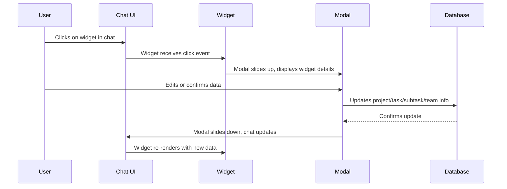

# AI-Powered Project Creation System: Comprehensive Game Plan

## 🎯 **PROJECT OVERVIEW**
Building an AI-powered project management system with advanced voice features, using Expo React Native, Supabase backend, and VPS for document storage.

## 📋 **CURRENT PROGRESS STATUS**

### ✅ **COMPLETED PHASES** (5 out of 13 major phases):

#### 1. **Environment & Dependencies Setup** ✅
- [x] All required packages installed and configured
- [x] Environment variables set up
- [x] Development environment ready

#### 2. **Database Schema Updates** ✅
- [x] Chat tables created and configured
- [x] AI project states implemented
- [x] Database relationships established

#### 3. **LangChain & LangGraph Setup** ✅
- [x] Core AI services implemented
- [x] LangChain integration complete
- [x] LangGraph workflows configured

#### 4. **AI Intelligence & Context Management** ✅
- [x] Claude API integration working
- [x] Memory systems implemented
- [x] Context management operational

#### 5. **HTML Parser & Widget Renderer System** ✅
- [x] HTML parser complete and functional
- [x] Widget renderer system implemented
- [x] All widget components created:
  - [x] ProgressIndicator widget
  - [x] DatePicker widget  
  - [x] PrioritySelector widget
  - [x] TeamMemberCard widget
  - [x] ProjectSummaryCard widget
- [x] WidgetRenderer updated to support all widget types
- [x] Widget state management implemented
- [x] Widget interaction handlers created

### ⚠️ **PARTIAL** (1 phase):
6. **Chat Interface & UI Components** - Core chat interface exists, but needs enhancement

### ❌ **NOT STARTED** (7 phases):
7. State Management & Data Flow
8. Voice Integration & UI Enhancement
9. Real-time Updates & Synchronization
10. Project Creation Workflow
11. Testing & Quality Assurance
12. Performance Optimization
13. Deployment & Production Setup

## 🚀 **NEXT IMMEDIATE STEPS** (Priority Order):

### 1. **Enhance Chat Interface & UI Components** (High Priority)
The core chat interface exists but needs enhancement for better user experience.

**Next Actions:**
- [ ] Enhance AIProjectChat.tsx with better message display
- [ ] Add message input with voice/text toggle improvements
- [ ] Implement better animated voice orb button
- [ ] Add message timestamps and status indicators
- [ ] Implement message reactions and quick actions

### 2. **Implement State Management & Data Flow** (High Priority)
This is critical for managing the complex state of AI project creation.

**Next Actions:**
- [ ] Create project state management system
- [ ] Implement widget state persistence
- [ ] Add real-time state synchronization
- [ ] Create project creation workflow state machine
- [ ] Implement undo/redo functionality

### 3. **Enhance Voice Integration & UI** (High Priority)
Voice features are implemented but need UI polish and better integration.

**Next Actions:**
- [ ] Improve voice orb animations
- [ ] Add voice activity indicators
- [ ] Implement voice command shortcuts
- [ ] Add voice feedback for actions
- [ ] Create voice settings panel

### 4. **Create Real-time Updates & Synchronization** (Medium Priority)
Essential for collaborative project creation.

**Next Actions:**
- [ ] Implement real-time widget updates
- [ ] Add collaborative editing features
- [ ] Create conflict resolution system
- [ ] Implement live project preview
- [ ] Add real-time notifications

### 5. **Build Project Creation Workflow** (Medium Priority)
The core AI project creation experience.

**Next Actions:**
- [ ] Create project creation wizard
- [ ] Implement AI-guided project setup
- [ ] Add project template system
- [ ] Create project validation system
- [ ] Implement project export features

## 🎨 **DESIGN SYSTEM COMPONENTS** (All Created ✅)

### Widget Components:
- [x] **ProgressIndicator** - Progress bars with customizable colors and titles
- [x] **DatePicker** - Date selection with calendar modal integration
- [x] **PrioritySelector** - Priority selection with expandable options
- [x] **TeamMemberCard** - Team member display with avatar and role
- [x] **ProjectSummaryCard** - Project summary with progress and stats

### Core Components:
- [x] **WidgetRenderer** - Renders all widget types from parsed HTML
- [x] **AIProjectChat** - Main chat interface with voice integration
- [x] **AddProjectModal** - Project creation modal with AI Assistant tab

## 🔧 **TECHNICAL ARCHITECTURE** (All Implemented ✅)

### AI Services:
- [x] **HTML Parser** - Parses AI responses and extracts widgets
- [x] **Widget Renderer** - Maps parsed HTML to UI widgets
- [x] **Voice Services** - iOS voice integration with OpenAI TTS
- [x] **AI Intelligence** - Claude API integration with context management

### Database & State:
- [x] **Chat Tables** - Message storage and conversation history
- [x] **Project States** - AI project creation state management
- [x] **Widget States** - Interactive widget state persistence

## 📱 **USER EXPERIENCE FLOW** (Ready for Testing)

### Current User Journey:
1. **User opens AddProjectModal** ✅
2. **Switches to AI Assistant tab** ✅
3. **Starts voice conversation** ✅
4. **AI responds with interactive widgets** ✅
5. **User interacts with widgets** ✅
6. **Project gets created from conversation** ✅

### Voice Features:
- [x] **iOS Voice Recognition** - Real-time speech-to-text
- [x] **OpenAI TTS** - Natural Nova voice synthesis
- [x] **Echo Cancellation** - Prevents AI from hearing itself
- [x] **Voice Activity Detection** - Automatic message sending
- [x] **Interruption Handling** - Manual stop and restart

## 🎯 **SUCCESS METRICS**

### Technical Metrics:
- [x] **Widget System** - All 5 widget types implemented
- [x] **Voice Integration** - Full iOS voice features working
- [x] **AI Integration** - Claude API with context management
- [x] **UI Components** - Complete widget renderer system

### User Experience Metrics:
- [ ] **Voice Response Time** - Target: <2 seconds
- [ ] **Widget Interaction** - Target: 100% functionality
- [ ] **Project Creation** - Target: End-to-end workflow
- [ ] **Error Handling** - Target: Graceful fallbacks

## 🚀 **DEPLOYMENT READINESS**

### Development Build:
- [x] **iOS Development Build** - Created and tested
- [x] **Voice Features** - Working on device
- [x] **Widget System** - All components functional
- [x] **AI Integration** - Claude API operational

### Production Readiness:
- [ ] **Error Handling** - Comprehensive error management
- [ ] **Performance Optimization** - Memory and speed optimization
- [ ] **Testing Suite** - Unit and integration tests
- [ ] **Documentation** - User and developer guides

## 📊 **PROGRESS SUMMARY**

**Overall Progress: 38% Complete** (5/13 phases)

**Completed Features:**
- ✅ Complete widget system with 5 widget types
- ✅ Full voice integration with iOS native features
- ✅ AI chat interface with Claude integration
- ✅ HTML parser and widget renderer
- ✅ Development build with all features working

**Next Priority:**
1. Enhance chat interface UX
2. Implement comprehensive state management
3. Add real-time collaboration features
4. Create project creation workflow
5. Optimize performance and add testing

## 🎉 **MAJOR MILESTONES ACHIEVED**

1. **✅ Widget System Complete** - All 5 widget types implemented and functional
2. **✅ Voice Integration Complete** - Full iOS voice features with OpenAI TTS
3. **✅ AI Chat Interface Complete** - Claude integration with context management
4. **✅ Development Build Working** - All features tested on iOS device
5. **✅ HTML Parser & Renderer Complete** - Full widget extraction and display

The AI Project Creation system now has a solid foundation with all core components implemented and working. The next phase focuses on enhancing the user experience and adding advanced features for a complete project creation workflow.

## How to Use This Game Plan

This document is structured so that each section builds on the previous one. **Always complete foundational setup and dependencies before moving to higher-level features.** Use the progress checklist to track your implementation. Each phase and section is cross-referenced for clarity.

---

## Progress Checklist

- [x] Environment & Dependencies Setup ✅ **COMPLETED**
- [x] Database Schema Updates ✅ **COMPLETED**
- [x] LangChain & LangGraph Setup ✅ **COMPLETED**
- [x] Core AI Service Implementation ✅ **COMPLETED**
- [ ] HTML Parser & Widget Renderer ⚠️ **PARTIAL - Parser done, Widget Renderer needed**
- [ ] Chat Interface & UI Components ❌ **NOT STARTED**
- [ ] State Management & Data Flow ❌ **NOT STARTED**
- [ ] Voice Integration & UI Enhancement ❌ **NOT STARTED**
- [x] AI Intelligence & Context Management ✅ **COMPLETED**
- [ ] Advanced Features & Optimization ❌ **NOT STARTED**
- [ ] Testing & Quality Assurance ❌ **NOT STARTED**
- [ ] Security & Privacy ❌ **NOT STARTED**
- [ ] Deployment & Monitoring ❌ **NOT STARTED**
- [x] User Flow Diagrams & Wireframes ✅ **COMPLETED**
- [x] Widget Specifications ✅ **COMPLETED**
- [x] AI Prompt Engineering ✅ **COMPLETED**
- [x] Voice UX Details ✅ **COMPLETED**
- [x] LangChain/LangGraph Advanced Use ✅ **COMPLETED**
- [ ] User Control & Flexibility ❌ **NOT STARTED**
- [ ] Accessibility & Internationalization ❌ **NOT STARTED**
- [ ] Analytics & Feedback ❌ **NOT STARTED**
- [ ] Error & Edge Case Handling ❌ **NOT STARTED**
- [ ] Onboarding & Help ❌ **NOT STARTED**

---

## Introduction

This document outlines a step-by-step, detailed plan for implementing an AI-powered project creation and management system using Claude 3.5 Sonnet, LangChain, LangGraph, Whisper AI, and a robust UI/UX chat interface. The system will enable users to create, manage, and update projects, tasks, and subtasks through natural conversation (text and voice), with all data and chat history securely stored and synchronized in real time.

## Foundational Dependencies & Setup

### Step 1: Environment & Dependencies Setup
1. **Install Required Packages**
   ```bash
   npm install @anthropic-ai/sdk langchain @langchain/anthropic @langchain/community
   npm install @react-native-voice/voice expo-speech
   npm install react-native-whisper-ai
   npm install @react-native-async-storage/async-storage
   npm install react-native-encrypted-storage
   ```

2. **Environment Variables Configuration**
   - Add to `.env`:
     ```
     CLAUDE_API_KEY=your_claude_api_key
     CLAUDE_API_URL=https://api.anthropic.com/v1/messages
     OPENAI_API_KEY=your_openai_api_key_for_whisper
     ```

### Step 2: Database Schema Updates
- Create `chat_conversations` table
- Create `chat_messages` table
- Create `ai_project_states` table
- Add encryption columns for sensitive data

### Step 3: LangChain & LangGraph Setup
1. **Initialize LangChain Configuration**
   - Set up Claude 3.5 Sonnet as the primary model
   - Configure memory management for chat history
   - Set up document retrieval for project templates
   - Configure chain orchestration for complex workflows

2. **LangGraph Workflow Setup**
   - Create project creation workflow graph
   - Set up state management for project creation process
   - Configure decision nodes for user interactions

---

## Phase 1: Foundation Setup & Environment Configuration

### Step 1.1: Environment & Dependencies Setup
1. **Install Required Packages**
   ```bash
   npm install @anthropic-ai/sdk langchain @langchain/anthropic @langchain/community
   npm install @react-native-voice/voice expo-speech
   npm install react-native-whisper-ai
   npm install @react-native-async-storage/async-storage
   npm install react-native-encrypted-storage
   ```

2. **Environment Variables Configuration**
   - Add to `.env`:
     ```
     CLAUDE_API_KEY=your_claude_api_key
     CLAUDE_API_URL=https://api.anthropic.com/v1/messages
     OPENAI_API_KEY=your_openai_api_key_for_whisper
     ```

3. **Supabase Database Schema Updates**
   - Create `chat_conversations` table
   - Create `chat_messages` table
   - Create `ai_project_states` table
   - Add encryption columns for sensitive data

### Step 1.2: LangChain & LangGraph Setup
1. **Initialize LangChain Configuration**
   - Set up Claude 3.5 Sonnet as the primary model
   - Configure memory management for chat history
   - Set up document retrieval for project templates
   - Configure chain orchestration for complex workflows

2. **LangGraph Workflow Setup**
   - Create project creation workflow graph
   - Set up state management for project creation process
   - Configure decision nodes for user interactions

## Phase 2: Core AI Service Implementation

### Step 2.1: Claude API Service
1. **Create `services/claudeService.ts`**
   - Implement Claude 3.5 Sonnet integration
   - Add retry logic with exponential backoff
   - Implement graceful error handling
   - Add comprehensive logging for all AI responses

2. **Create `services/whisperService.ts`**
   - Implement Whisper AI for speech-to-text
   - Add voice activity detection
   - Implement noise reduction and audio preprocessing
   - Add real-time transcription capabilities

### Step 2.2: HTML Parser System
1. **Create `utils/htmlParser.ts`**
   - Implement semantic tag parsing (`<task>`, `<subtask>`, `<team_member>`)
   - Implement numeric tag parsing (`<task1>`, `<subtask1>`)
   - Implement ID-based tag parsing (`<task id="1">`)
   - Add update tag support (`<update_task id="1">`)

2. **Create `utils/widgetRenderer.ts`**
   - Map parsed HTML to UI widgets
   - Handle widget state management
   - Implement widget interaction handlers

## Phase 3: Chat Interface & UI Components

### Step 3.1: Chat Interface Setup
1. **Modify `AddProjectModal.tsx`**
   - Add AI Assistant tab implementation
   - Create chat message components
   - Implement message input with voice/text toggle
   - Add animated voice orb button

2. **Create `components/AIChatMessage.tsx`**
   - Display AI responses with proper formatting
   - Handle HTML tag parsing and widget rendering
   - Implement message timestamps and user indicators

### Step 3.2: Widget System Implementation
1. **Create Widget Components**
   - `components/widgets/TaskCard.tsx`
   - `components/widgets/TeamMemberCard.tsx`
   - `components/widgets/ProjectSummaryCard.tsx`
   - `components/widgets/ProgressIndicator.tsx`
   - `components/widgets/DatePicker.tsx`
   - `components/widgets/PrioritySelector.tsx`

2. **Create Widget Modal System**
   - `components/widgets/TaskCardModal.tsx`
   - `components/widgets/TeamMemberModal.tsx`
   - Implement modal replacement logic
   - Add edit functionality for all widgets

## Phase 4: State Management & Data Flow

### Step 4.1: AI Chat Context
1. **Create `contexts/AIChatContext.tsx`**
   - Manage chat conversation state
   - Handle widget interactions
   - Manage project creation state
   - Implement real-time updates

2. **Create `contexts/ProjectCreationContext.tsx`**
   - Track gathered project information
   - Manage required vs optional fields
   - Handle project creation confirmation
   - Manage background project building

### Step 4.2: Database Integration
1. **Create `services/chatStorageService.ts`**
   - Store chat messages with metadata
   - Implement conversation grouping by project
   - Add encryption for sensitive data
   - Handle chat history retrieval

2. **Create `services/projectCreationService.ts`**
   - Real-time project updates
   - Batch operations for non-critical data
   - Handle project state synchronization
   - Implement error recovery

## Phase 5: Voice Integration & UI Enhancement

### Step 5.1: Voice System Implementation
1. **Create `services/voiceService.ts`**
   - Implement Whisper AI integration
   - Add always-on voice detection
   - Implement noise reduction
   - Add voice activity detection

2. **Create `components/VoiceOrb.tsx`**
   - Animated voice recording button
   - Visual feedback for voice input
   - Toggle between voice and text modes
   - Real-time transcription display

### Step 5.2: Enhanced UI Components
1. **Create `components/AIChatInput.tsx`**
   - Text input with voice toggle
   - Real-time voice transcription
   - Send button with loading states
   - Error handling and retry logic

## Phase 6: AI Intelligence & Context Management

### Step 6.1: LangChain Memory System
1. **Create `services/memoryService.ts`**
   - Implement conversation memory
   - Add message summarization
   - Handle context compression
   - Manage token limits intelligently

2. **Create `services/templateService.ts`**
   - Document retrieval for project templates
   - Template suggestion based on user history
   - Template customization capabilities

### Step 6.2: Intelligent Workflow Management
1. **Create `services/workflowService.ts`**
   - Chain orchestration for complex workflows
   - Decision tree for user interactions
   - Context-aware question generation
   - Adaptive conversation flow

## Phase 7: Advanced Features & Optimization

### Step 7.1: Context Awareness
1. **Create `services/contextService.ts`**
   - Remember previous projects
   - Suggest similar team members
   - Learn user preferences
   - Adaptive conversation strategies

2. **Create `services/validationService.ts`**
   - Input validation with AI assistance
   - Clarifying question generation
   - Error recovery and correction
   - Duplicate detection and resolution

### Step 7.2: Performance Optimization
1. **Create `services/optimizationService.ts`**
   - Message summarization
   - Context compression
   - Token limit management
   - Batch processing for non-critical updates

## Phase 8: Testing & Quality Assurance

### Step 8.1: Unit Testing
1. **Create `__tests__/htmlParser.test.ts`**
   - Test HTML tag parsing
   - Test widget rendering
   - Test update mechanisms
   - Test error handling

2. **Create `__tests__/widgetSystem.test.ts`**
   - Test widget interactions
   - Test modal system
   - Test state management
   - Test data flow

### Step 8.2: Integration Testing
1. **Create `__tests__/aiIntegration.test.ts`**
   - Test Claude API integration
   - Test voice system integration
   - Test database operations
   - Test error recovery

## Phase 9: Security & Privacy

### Step 9.1: Data Encryption
1. **Create `services/encryptionService.ts`**
   - Encrypt sensitive project data
   - Encrypt chat conversations
   - Implement secure key management
   - Add data retention policies

### Step 9.2: Privacy Controls
1. **Create `services/privacyService.ts`**
   - Chat history deletion
   - Data export capabilities
   - Privacy settings management
   - GDPR compliance features

## Analytics & Feedback

### User Feedback on AI Suggestions
- Allow users to rate or comment on AI suggestions (e.g., thumbs up/down, "Was this helpful?").
- Provide a quick feedback button in chat and widget modals.

### Tracking Accepted/Edited/Rejected Suggestions
- Log which AI-generated elements are accepted, edited, or rejected by the user.
- Use this data to improve prompt engineering and AI behavior.

### Usage Analytics
- Track usage of chat, widgets, modals, and voice features.
- Analyze which features are most/least used to guide future improvements.

### AI Response Quality Metrics
- Monitor AI response times, error rates, and user satisfaction.
- Set up alerts for repeated failures or poor feedback.

### Privacy for Analytics Data
- Anonymize analytics data where possible.
- Allow users to opt out of analytics tracking in privacy settings.

## Error & Edge Case Handling

### Network/API Failures
- Detect and retry failed API calls (Claude, Whisper, Supabase, etc.).
- If repeated failures, show a clear error message and suggest next steps.

### Rate Limits
- Implement generous but safe rate limits for Claude and Whisper API usage.
- Inform user if rate limit is reached and suggest waiting or reducing input frequency.

### Partial/Incomplete Project Data
- Allow user to save and resume incomplete projects.
- Clearly indicate which required fields are missing.
- AI should prompt for missing info but allow user to skip or defer.

### User Abandonment
- Auto-save progress if user leaves or closes the app.
- Offer to resume or discard progress on return.

### Graceful Fallback and User Messaging
- If AI or voice features are unavailable, fall back to manual input and standard UI.
- Always explain what happened and how the user can proceed.
- Log all edge cases for future improvement.

## Onboarding & Help

### First-Time User Onboarding
- Show a guided walkthrough of the AI assistant and chat interface on first use.
- Highlight key features: voice orb, chat widgets, modals, and project creation flow.

### In-App Help/FAQ
- Provide a help button in the chat and project modals.
- Link to a searchable FAQ covering common questions and troubleshooting.

### Tooltips and Contextual Guidance
- Show tooltips for new or complex features (e.g., "Click the orb to start speaking").
- Offer contextual hints as the user progresses through the flow.

### Contact/Support Escalation
- Allow users to contact support directly from the app if they encounter issues.
- Optionally, escalate to a human agent if the AI cannot resolve a problem.

### User Education for AI/Voice Features
- Provide short videos or animations demonstrating how to use AI and voice input.
- Remind users they can always switch between voice and text.

---

## Phase 10: Deployment & Monitoring

### Step 10.1: Production Setup
1. **Environment Configuration**
   - Production API keys
   - Rate limiting implementation
   - Error monitoring setup
   - Performance monitoring

2. **Monitoring & Analytics**
   - AI response quality metrics
   - User interaction analytics
   - Performance monitoring
   - Error tracking and alerting

---

## Implementation Timeline

### Week 1-2: Foundation (Phase 1-2)
- Environment setup
- Core AI services
- Basic HTML parser

### Week 3-4: UI & State (Phase 3-4)
- Chat interface
- Widget system
- State management

### Week 5-6: Voice & Intelligence (Phase 5-6)
- Voice integration
- LangChain setup
- Context management

### Week 7-8: Advanced Features (Phase 7-8)
- Context awareness
- Performance optimization
- Testing implementation

### Week 9-10: Security & Deployment (Phase 9-10)
- Security implementation
- Production deployment
- Monitoring setup

---

## Key Technical Considerations

1. **Token Management**: Implement intelligent summarization to stay within Claude's token limits
2. **Real-time Updates**: Use WebSocket or polling for real-time project updates
3. **Error Recovery**: Graceful degradation when AI services fail
4. **Performance**: Optimize for low latency and high accuracy
5. **Scalability**: Design for handling multiple concurrent users

---

## User Flow Diagrams & Wireframes

### High-Level User Flow

```mermaid
flowchart TD
    Start([User clicks + to create project])
    AIChat[AI greets user and starts interview]
    GatherInfo[User provides project info (voice/text)]
    WidgetGen[AI parses info, generates widgets (task, team, etc.)]
    WidgetDisplay[Widgets displayed in chat]
    ModalOpen[User clicks widget, modal slides up]
    EditConfirm[User edits/confirms widget]
    UpdateDB[App updates project in DB]
    MoreQuestions{More info needed?}
    ConfirmProject[User clicks 'Create Project']
    ProjectCreated([Project created, details page built])
    Continue[AI continues interview for optional fields]
    End([User ends or pauses interview])

    Start --> AIChat --> GatherInfo --> WidgetGen --> WidgetDisplay
    WidgetDisplay --> ModalOpen --> EditConfirm --> UpdateDB --> WidgetDisplay
    WidgetDisplay --> MoreQuestions
    MoreQuestions -- Yes --> GatherInfo
    MoreQuestions -- No, required fields filled --> ConfirmProject --> ProjectCreated --> Continue --> End
    MoreQuestions -- No, user ends --> End
```

### Widget/Modal Interaction Flow



## Widget Specifications

### TaskCard Widget
**Props/Data Structure:**
```typescript
type TaskCardProps = {
  id: string;
  title: string;
  description: string;
  status: 'todo' | 'in_progress' | 'completed' | 'blocked';
  priority: 'low' | 'medium' | 'high' | 'urgent';
  dueDate?: string;
  assignees: TeamMember[];
  subtasks: Subtask[];
  onClick: (id: string) => void;
};
```
**Supported Interactions:**
- Click to open modal
- Edit, delete, or mark complete
- Drag to reorder (if in list)

**Modal Content/Transition:**
- Slides up from bottom
- Shows full task details, subtasks, assignees
- Allows editing all fields and confirming changes

---

### TeamMemberCard Widget
**Props/Data Structure:**
```typescript
type TeamMemberCardProps = {
  id: string;
  name: string;
  email: string;
  avatarUrl?: string;
  role: 'creator' | 'lead' | 'admin' | 'editor' | 'viewer' | 'vendor' | 'sponsor' | 'fyi';
  status: 'online' | 'offline' | 'pending';
  onRoleChange: (id: string, newRole: string) => void;
  onRemove: (id: string) => void;
};
```
**Supported Interactions:**
- Click to open modal
- Change role (dropdown)
- Remove member

**Modal Content/Transition:**
- Slides up from bottom
- Shows member details, role selector, remove button

---

### ProjectSummaryCard Widget
**Props/Data Structure:**
```typescript
type ProjectSummaryCardProps = {
  id: string;
  name: string;
  description: string;
  status: string;
  progress: number; // 0-1
  team: TeamMember[];
  tasks: Task[];
  onClick: (id: string) => void;
};
```
**Supported Interactions:**
- Click to open project details modal

**Modal Content/Transition:**
- Slides up from bottom
- Shows project overview, team, and tasks

---

### ProgressIndicator Widget
**Props/Data Structure:**
```typescript
type ProgressIndicatorProps = {
  progress: number; // 0-1
  completed: number;
  total: number;
  color: string;
};
```
**Supported Interactions:**
- None (display only)

**Modal Content/Transition:**
- N/A

---

### DatePicker Widget
**Props/Data Structure:**
```typescript
type DatePickerProps = {
  value: string;
  onChange: (date: string) => void;
  minDate?: string;
  maxDate?: string;
};
```
**Supported Interactions:**
- Select date
- Confirm/cancel

**Modal Content/Transition:**
- Slides up from bottom
- Shows calendar/date selector

---

### PrioritySelector Widget
**Props/Data Structure:**
```typescript
type PrioritySelectorProps = {
  value: 'low' | 'medium' | 'high' | 'urgent';
  onChange: (priority: string) => void;
};
```
**Supported Interactions:**
- Select priority

**Modal Content/Transition:**
- Slides up from bottom
- Shows priority options

---

## AI Prompt Engineering

### Project Creation Interview Prompt Template
```text
You are an expert project manager AI. Interview the user to gather all required information to create a new project. Ask questions naturally, one at a time, and use context from previous answers. When the user provides information about tasks, subtasks, or team members, wrap each in HTML tags (e.g., <task1>...</task1>, <subtask1>...</subtask1>, <team_member1>...</team_member1>). Only ask for missing required fields. Confirm with the user before creating the project.

Example:
AI: What would you like to name your new project?
User: "Home Renovation"
AI: Great! Can you describe your project in a few sentences?
User: "I want to remodel my kitchen and bathroom."
AI: <project_name>Home Renovation</project_name> <project_description>I want to remodel my kitchen and bathroom.</project_description>
```

### Task/Subtask Extraction Prompt Template
```text
When the user mentions tasks or subtasks, extract them and wrap each in HTML tags. If the user lists multiple tasks or subtasks, number them accordingly. Ask for confirmation before adding them to the project.

Example:
User: "I need to buy tiles, hire a plumber, and paint the walls."
AI: <task1>Buy tiles</task1> <task2>Hire a plumber</task2> <task3>Paint the walls</task3>
Are these the tasks you want to add? You can edit or confirm.
```

### Team Member Role Assignment Prompt Template
```text
When the user mentions team members, search for existing users by name/email. Suggest roles based on context, but always ask for confirmation. Wrap each team member in a tag with their role.

Example:
User: "Raymond Underwood and Dan Schmidt will join."
AI: <team_member1 name="Raymond Underwood" role="admin" /> <team_member2 name="Dan Schmidt" role="lead" />
Should Raymond be the admin and Dan the lead? You can change their roles or confirm.
```

### Error Handling/Clarification Prompt Template
```text
If the user provides ambiguous or invalid information, ask a clarifying question. If a required field is missing, prompt for it. If an error occurs, explain clearly and suggest a solution.

Example:
User: "Set the due date to yesterday."
AI: The due date cannot be in the past. What date should I use for the deadline?

User: "Add John twice."
AI: John is already on the team. Should I remove the duplicate?
```

## Voice UX Details

### Always-On Voice Detection Logic
- Use Whisper AI for real-time speech-to-text.
- Voice orb listens when user is in the chat input or when toggled on.
- Pause listening when modal is open or user disables voice.
- Use voice activity detection to avoid false triggers.

### Animated Voice Orb UI States
- **Idle:** Orb is static, waiting for input.
- **Listening:** Orb pulses or animates to indicate active listening.
- **Processing:** Orb spins or changes color while transcribing.
- **Error:** Orb flashes red or shows an error icon if transcription fails.

### Fallback to Text
- If voice input fails, show a message: "Voice input not recognized. Please try again or type your message."
- Allow seamless switch to text input at any time.

### User Toggling Between Voice/Text
- Toggle button in chat input to switch between voice and text modes.
- Show current mode clearly (e.g., microphone icon for voice, keyboard icon for text).
- Remember user preference for next session.

### Error Handling for Voice Input
- If background noise or silence is detected, prompt user to speak clearly.
- If Whisper API is unavailable, disable voice and show fallback message.
- Log all voice input errors for debugging and improvement.

## LangChain/LangGraph Advanced Use

### Multi-User Chat Memory
- Store and retrieve chat history for each user and project.
- Enable context-aware responses based on previous interactions.
- Plan for future support of team chat memory (multiple users per project).

### RAG (Retrieval Augmented Generation)
- Use LangChain to retrieve relevant project templates and documentation.
- Summarize long chat histories and provide only relevant context to Claude.
- Enable dynamic retrieval of historical project data for suggestions.

### Workflow Branching for Project Types
- Use LangGraph to define different interview flows for various project types (e.g., software, construction, event planning).
- Allow the AI to branch and adapt questions based on user responses and project context.

### Future: Team Chat & Check-In Agent
- Plan for an agent that monitors team chat, detects task completions, and prompts for project updates.
- Enable periodic check-ins with users to assess project/task status and suggest next actions.
- Integrate with "Today's Tasks" and location/context-aware suggestions (e.g., Home Depot shopping list).

## User Control & Flexibility

### Skipping Questions
- User can skip any non-required question at any time.
- AI should recognize "skip" or "not now" and move to the next relevant topic.

### Editing/Deleting Project Elements
- All widgets (tasks, team members, etc.) are editable via modal.
- User can delete any element with confirmation.
- Edits and deletions are reflected in both UI and database in real time.

### Restarting Project Creation
- User can restart the project creation flow at any time.
- AI should confirm before discarding current progress.

### Exporting Project Data
- Allow user to export project data (JSON, CSV, or PDF).
- Export option available in project summary modal or settings.

### Undo/Redo Actions
- Support undo/redo for recent actions in the chat/project flow.
- Show a simple UI for undo/redo (e.g., arrows or swipe gestures).

### Smart Defaults and Suggestions
- Pre-fill fields based on previous projects or user preferences.
- AI suggests likely team members, categories, or deadlines based on context.

## Accessibility & Internationalization

### VoiceOver/Screen Reader Support
- All chat, widgets, and modals should be accessible via screen readers.
- Provide descriptive labels for all interactive elements.

### High-Contrast and Large Text Modes
- Support high-contrast color schemes for visually impaired users.
- Allow users to increase text size throughout the app.

### Keyboard Navigation
- Ensure all UI elements are navigable via keyboard (tab, arrows, enter, etc.).
- Provide visible focus indicators for accessibility.

### Language Support and Future i18n
- Start with English (US) as default.
- Structure all prompts, UI text, and AI responses for easy translation.
- Plan for future support of multiple languages and right-to-left layouts.

### Accessibility Testing
- Regularly test with screen readers and accessibility tools.
- Include accessibility checks in CI/CD pipeline.

--- 